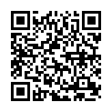

# 職務経歴書

## このサイトへのリンク

## 基本情報

|key|value|
|---|-----|
|Name|桑田 詠士 (Eiji Kuwata))|
|Qiita|[tarokamikaze](https://qiita.com/tarokamikaze)|
|Github|[tarokamikaze](https://github.com/tarokamikaze)|

## スキル

### マネジメント
- アジャイル開発手法を用いたシステム設計
- スクラムを中心としたエンジニアチームマネジメント(メンバー最大6名)
- ベンダーコントロール

### 言語

- プログラミング言語
  - golang (2016/09~)
  - PHP (2011/05~2016/09)
  - Salesforce Apex (2016/09~2017/09)
  - Javascript (2008/05~)
  - Java (2013/06~ 2013/09)
  - Ruby (2015/06~ 2015/07)
  - Python (2017/09~2017/11)
  - Swift (2018/05~)
  - ShellScript (2011/05~)
- 日本語
  - ネイティブ
- 英語（例）
  - かんたんな日常会話ができる
  - オフショアの開発エンジニア向けに、開発チケットを作成できる

### フレームワーク
以下はすべて、私が主導して社内初導入したものです。

- [Symfony (PHP)](https://symfony.com/)
- [Echo (golang)](https://echo.labstack.com/)
- [Goa (golang)](https://goa.design/)

### インフラ他
以下はすべて、私が主導して社内初導入したものです。

- オンプレミスLinuxサーバーの構築、運用 (CentOS 6, Ubuntu)
- AWS環境の設計、構築、運用
  - EC2
  - Route53
  - RDS
- Heroku環境の設計、構築、運用
- GCP環境の設計、構築、運用
  - AppEngine
  - BigQuery
  - Datastore
  - CloudFunctions
  - Firebase Authentication / Realtime Database

### DB / Cache
- MySQL
- PostgreSQL
- MongoDB
- Redis
- Memcache

### OS
- Ubuntuサーバーの構築、運用
- CentOS6サーバーの構築、運用
- Docker環境の設計、構築、運用

### その他
以下はすべて、私が主導して社内初導入したものです。

- Salesforceカスタマイズの企画、設計、開発、運用
- TDD
  - CircleCIの設定、運用
  - Jenkinsの構築、設定、運用
  - PHPUnit
  - go test
  - PhantomJS
- git
	- Githubの導入、運用
	- 社内GitLabサーバーの導入、構築、運用

## 強み

- エンジニアマネジメント、要件定義からサーバーサイドを中心とした開発、インフラ構築まで一気通貫で行えます
- B2B, B2Cシステムの幅広い開発経験があります
- 各種エンジニアリング技法を主体的に導入することで、チームの開発効率を改善させた経験が多々あります

## やったことはないが興味があるもの

- プロダクトマネージャーとしてサービス開発を牽引すること
- 10人以上のチームやベンダーをマネジメントしての大規模システム開発
- Kubernetesを利用した大規模なクラウドオートスケーリング環境の設計、構築
- ChatOps(Slack Bot)を活用した業務改善案の企画、構築
- Firestoreを活用したサーバーレスなモバイルアプリの設計

## 職務経歴

### 2011/05 - : 株式会社フルスピード

職務: システムエンジニア / サブマネージャー

各種システムのエンジニアマネジメント、システム/インフラ設計、サーバーサイドを中心としたプログラム開発、運用を行いました。
WebUIシステムの事実上のリードエンジニアとして、サーバーサイドやアジャイルマネジメントを中心とした新技術や開発手法の導入を主導しました。
またサブマネージャーとして、採用や人材育成にも力を入れました。

#### SNSモバイルアプリ開発担当 : プロジェクトマネージャー / サーバーサイドエンジニア(2017/09~)

https://itunes.apple.com/jp/app/id1364023375?mt=8

プロジェクトマネージャー兼サーバーサイドエンジニアとして、SNSモバイルアプリ(自社開発)の企画-開発を担当しました。
サーバーサイドの開発は私一人で行い、Swiftの開発のヘルプも実施しました。

##### 開発環境
- Github
- golang(Goa)
- Swift
- GCP
- CircleCI

##### 担当業務

- 新サービス検討
- エンジニアマネジメント
- 技術選定
- インフラ設計
- サービスアーキテクチャ検討
- 要件定義・基本設計・詳細設計
- 実装・テスト・リリース・障害対応

#### Salesforce導入 : プロジェクトマネージャー / サーバーサイドエンジニア(2016/09~2017/09)

営業支援用のSaasであるSalesforceの導入を主導しました。
自身で開発する他、開発支援ベンダーのハンドリングや、Salesforce社営業マンを通じた各種事例の収集と社内共有も実施しました。

##### 開発環境
- Github
- golang(Echo)
- Apex
- Heroku
- CircleCI

##### 担当業務

- 業務分析
- 技術選定
- エンジニアマネジメント
- インフラ設計
- サービスアーキテクチャ検討
- 要件定義・基本設計・詳細設計
- 実装・テスト・リリース・障害対応
- ベンダーコントロール

#### B2BWebシステム : プロジェクトリーダー / サーバーサイドエンジニア(2011/09~2017/09)

ディスプレイ広告配信サービスの配信管理システムの開発を担当しました。

##### 開発環境
- Github
- PHP(Symfony)
- AWS
- オンプレミス Linuxサーバー

##### 担当業務

- エンジニアマネジメント
- 業務分析
- 技術選定
- 要件定義・基本設計・詳細設計
- 実装・テスト・リリース・障害対応

### 2011/05 - 2011/09 社内向けシステム: システムエンジニア

社内業務改善システムの開発を担当しました。

##### 開発環境
- Github
- PHP(社内フレームワーク)
- オンプレミス Linuxサーバー

##### 担当業務

- 要件定義・基本設計・詳細設計
- 実装・テスト・リリース・障害対応

### 2007/05 - 2011/05 : 株式会社ゲイン
職務: 社内SE

#### 会員向けアンケートシステム移行プロジェクト: プロジェクトリーダー(2010/10~2011/05)

アンケートシステムの陳腐化、ランニングコストの高止まりの改善。同時に、他社サイトとの連携機能の強化を図るため、移行プロジェクトを主導しました。

- 要件定義
- 業者選定
- プロジェクト管理
- ベンダーコントロール
- 事業計画書作成
- 自社会員向け広報

#### 社内インフラ関連業務(2007/11~2011/05)

- PC管理、キッティング、ライセンス管理
- ヘルプデスク対応
- ファイルサーバー管理
- ネットワーク配線、管理
- ユーザーアカウント、メールアカウント管理

#### サイト運用関連業務(2007/11~2011/05)
- 会員向けサイトの運用管理、機能改善の要件定義、ベンダーコントロール
- 企業向けサイト、会員向けサイトの更新
- アンケート画面製作ヘルプ（画面遷移ロジックや、スタイルシートのカスタマイズ）
- 社内基幹系システム運用管理

#### その他(2007/5~2011/05)
- Excel ・Access集計用VBAの製作
- グループウェア運用管理
- セキュリティポリシー策定、運用
- セキュリティソフト導入・運用管理

### 2005/12 - 2006/12 : 株式会社ジャパン・ビジネス・サービス(派遣社員)

株式会社だいこう証券ビジネスに派遣社員として就業。
株主より集められたアンケートのデータ集計・分析業務に従事。
派遣社員ながら業務改善、進捗管理を実施しました。

### 2005/04 - 2005/09 : 株式会社ライダース・パブリシティ

一般広告を取り扱う部署において、ルート営業を中心に、企画作成・提案、校正作業に従事。
主な案件は、電力会社のキャンペーン企画、電気機器メーカーのカタログ作成。

